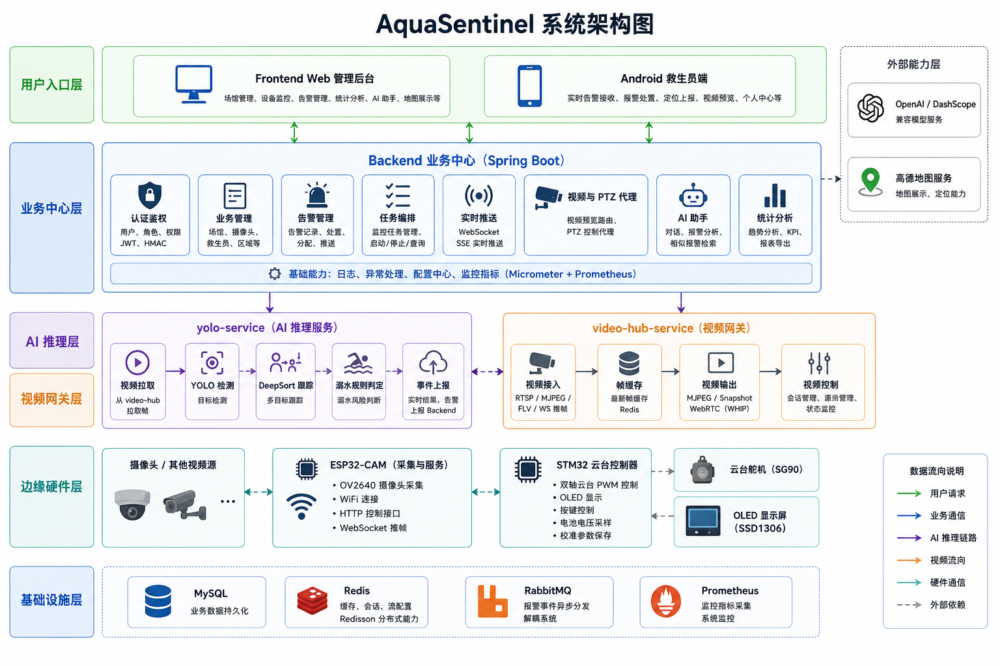
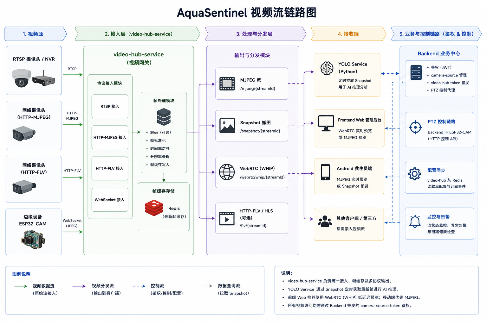

# AquaSentinel

<p align="left">
  
  
  
  
  
  
  
</p>

<p align="left">
  
  
  
  
  
  
</p>

<p align="left">
  
  
  
  
  
  
  
</p>
<p align="left">
  
  
  
  
  
  
  
</p><p align="left">
 </p>


> 面向泳池、场馆等水域场景的实时 AI 安全监控系统。项目覆盖视频流接入、YOLOv8 溺水检测、告警分发、Web 管理后台、Android 救生员端和硬件云台联动，重点解决“看得见、判得准、推得快、处置可追踪”的水上安全监控闭环。

---

## 项目特点

- **多服务协同架构**：系统由 `backend`、`frontend`、`yolo-service`、`video-hub-service`、`android`、`firmware` 多个子项目组成，覆盖后端业务、AI 推理、视频流网关、Web 管理端、移动端和硬件控制链路。
- **实时 AI 检测链路**：基于 YOLOv8 进行人体目标检测，结合 DeepSort 多目标跟踪和规则引擎进行溺水风险判定，将视频流分析结果实时推送到业务系统。
- **视频流接入与协议适配**：通过独立 `video-hub-service` 统一处理 RTSP、HTTP-MJPEG、HTTP-FLV、WebRTC 等视频预览和分发场景，降低 Backend 对视频转码和流协议的耦合。
- **端到端实时告警**：AI 服务通过 WebSocket 将检测结果推送到 Backend，Backend 负责告警落库、状态管理和 Web/Android 双端实时分发。
- **工程化接口治理**：后端通过 Knife4j/OpenAPI 输出接口规范，前端使用 openapi2ts 自动生成 API Controller 和类型定义，减少手写接口漂移。
- **项目特征**：项目包含 AI 推理、视频流处理、实时通信、多端协作、权限控制和硬件联动的完整工程实践。

---

## 效果展示

> 图片占位：后续可将截图放到 `docs/assets/` 目录，并替换下面的占位说明。

| 展示项         | 建议图片路径                                | 说明                                          |
| -------------- | ------------------------------------------- | --------------------------------------------- |
| 系统架构图     | `docs/assets/aquasentinel-architecture.png` | 展示多服务协同、视频流、AI 推理和告警分发链路 |
| 管理端总览     | `docs/assets/frontend-dashboard.png`        | 展示场馆、设备、告警和统计数据                |
| 监控预览页     | `docs/assets/frontend-monitor.png`          | 展示摄像头预览、检测框、云台控制等能力        |
| Android 告警页 | `docs/assets/android-alert.png`             | 展示救生员端实时告警接收和处置                |
| AI 检测动图    | `docs/assets/yolo-detection-demo.gif`       | 展示视频流中的目标检测和告警触发过程          |

---

## 系统架构




系统按职责拆分为多个可独立运行的服务：

| 模块                | 技术栈                                                           | 核心职责                                                   |
| ------------------- | ---------------------------------------------------------------- | ---------------------------------------------------------- |
| `backend`           | Java 17 / Spring Boot / MyBatis-Plus / MySQL / Redis / WebSocket | 用户认证、权限控制、告警落库、统计聚合、实时推送、业务 API |
| `frontend`          | Vue 3 / TypeScript / Vite / Pinia / Element Plus / ECharts       | 管理后台、设备监控、告警处置、数据看板、地图展示           |
| `yolo-service`      | Python / Flask / YOLOv8 / DeepSort / OpenCV / PyAV               | 视频流推理、目标检测、轨迹跟踪、溺水规则判定、AI 结果推送  |
| `video-hub-service` | Python / Flask / PyAV / aiortc / Redis Pub/Sub                   | 视频流统一接入、协议适配、预览分发、摄像头状态同步         |
| `android`           | Kotlin / Jetpack Compose / Retrofit / OkHttp / Media3            | 救生员移动端、实时告警接收、视频预览、巡检与处置           |
| `firmware`          | STM32 / ESP32-CAM                                                | 摄像头采集、云台控制、设备侧交互                           |

详细架构说明见 [docs/项目现状/architecture.md](docs/项目现状/architecture.md)。

---

## 核心业务链路

### 1. 视频流接入

摄像头或 ESP32-CAM 输出视频流后，由 `video-hub-service` 负责统一接入和协议适配。管理端不直接关心底层流协议，而是通过后端配置和视频网关获取可预览的视频地址。


```text
摄像头 / ESP32-CAM / RTSP 源
  ↓
video-hub-service
  ↓
HTTP-MJPEG / HTTP-FLV / WebRTC / 预览地址
  ↓
Frontend / Android
```



### 2. AI 推理与溺水判定

`yolo-service` 拉取视频流后执行 YOLOv8 目标检测，通过 DeepSort 为目标分配稳定轨迹，再由溺水规则服务根据持续时间、人体状态和轨迹变化判断是否触发风险事件。

```text
视频帧
  ↓
YOLOv8 人体检测
  ↓
DeepSort 多目标跟踪
  ↓
溺水规则判定
  ↓
检测事件 / 告警候选
```

### 3. 实时告警分发

AI 服务通过 WebSocket 将检测结果推送到 Backend。Backend 统一进行告警记录、状态维护、权限过滤和多端分发，最终让管理端和救生员 APP 同步看到告警。

```text
YOLO Service
  ↓ WebSocket
Backend
  ↓ 落库 + 状态管理
Frontend 管理后台 / Android 救生员端
  ↓
确认、派发、处置、追踪
```

---

## 技术难点与实现思路

### 视频流和业务系统解耦

早期视频预览如果直接放在 Backend 中处理，会让业务服务同时承担鉴权、CRUD、告警和视频转码职责。项目将视频流能力拆到 `video-hub-service`，Backend 只负责配置、权限和路由，视频网关负责拉流、协议适配和预览分发，使业务链路和视频链路职责更清晰。

### AI 推理任务生命周期管理

AI 服务不是简单地调用一次模型，而是需要管理持续运行的视频任务。项目将推理任务抽象为启动、运行、停止、异常等状态，并配套读帧线程、推理线程、推帧线程和任务状态维护，保证长时间视频流场景下可以控制任务生命周期。

### WebSocket 实时推送链路

告警链路同时涉及 AI 服务、后端、管理端和移动端。项目将 AI 结果接入和用户端告警推送拆成不同 WebSocket 通道：AI 服务只负责上报检测结果，Backend 负责告警落库、业务状态转换和多端推送，避免前端直接依赖 AI 服务。

### 接口一致性与类型安全

后端通过 Knife4j/OpenAPI 暴露接口规范，前端使用 openapi2ts 生成 API 调用代码和类型定义。业务页面通过 `services/` 层调用生成的接口，减少手写请求导致的字段不一致、路径漂移和响应结构误用。

### 多端协同处置闭环

Web 管理端更适合进行场馆、设备、地图和统计管理，Android 端更适合救生员现场接收和处置告警。项目通过统一 Backend 聚合状态，让两个端共享告警记录和处置结果，而不是各自维护独立状态。

---

## 功能模块

| 模块       | 功能                                                   |
| ---------- | ------------------------------------------------------ |
| 用户与权限 | 登录注册、JWT 鉴权、刷新令牌、角色权限、接口级权限校验 |
| 场馆管理   | 场馆、区域、摄像头、救生员等基础数据维护               |
| 视频监控   | 摄像头列表、实时预览、视频流路由、云台控制入口         |
| AI 检测    | 推理任务管理、检测结果上报、溺水规则判定               |
| 告警中心   | 告警生成、实时推送、确认、处置、记录追踪               |
| 数据看板   | 告警统计、设备状态、场馆态势、图表展示                 |
| 移动端     | 救生员登录、告警接收、视频查看、现场处置               |
| 硬件联动   | ESP32-CAM 视频采集、STM32 云台控制、OLED 信息显示      |

---

## 技术栈

| 层级         | 技术                                                                                         |
| ------------ | -------------------------------------------------------------------------------------------- |
| Backend      | Java 17 / Spring Boot 3.2.3 / MyBatis-Plus 3.5.5 / MySQL / Redis / JWT / WebSocket / Knife4j |
| Frontend     | Vue 3 / TypeScript / Vite 7 / Pinia / Element Plus / ECharts / 高德地图                      |
| YOLO Service | Python / Flask / Flask-Smorest / SQLAlchemy / YOLOv8 / DeepSort / OpenCV / PyAV              |
| Video Hub    | Python / Flask / PyAV / aiortc / Redis Pub/Sub                                               |
| Android      | Kotlin / Jetpack Compose / Retrofit / OkHttp / Media3 ExoPlayer / 高德 3D Map SDK            |
| Firmware     | STM32 / ESP32-CAM / OLED / 云台控制                                                          |

完整技术栈说明见 [docs/项目现状/tech-stack.md](docs/项目现状/tech-stack.md)。

---

## 快速开始

### Docker Compose 启动核心服务

```bash
docker compose up -d
```

### 验证核心服务状态

```bash
pwsh ./scripts/verify_core_stack.ps1
```

详细部署步骤见 [docs/运行部署/core-stack-quickstart.md](docs/运行部署/core-stack-quickstart.md)。

---

## 本地开发命令

### Backend

```bash
cd backend
mvn compile
mvn test
```

### Frontend

```bash
cd frontend
npm install
npm run dev
npm run build
```

### YOLO Service

```bash
cd yolo-service
pip install -r requirements.txt
python main.py --dev
pytest
```

### Android

```bash
cd android
./gradlew assembleDebug
./gradlew test
```

---

## 仓库结构

```text
AquaSentinel/
├── backend/              # Spring Boot 业务后端
├── frontend/             # Vue 3 管理后台
├── yolo-service/         # Flask + YOLOv8 AI 推理服务
├── video-hub-service/    # 视频流接入与协议适配服务
├── android/              # Jetpack Compose 移动端
├── firmware/             # STM32 / ESP32-CAM 硬件端代码
├── docs/                 # 架构、部署、规划和硬件文档
├── scripts/              # 启动、验证和辅助脚本
└── docker-compose.yml    # 核心服务编排
```

---

## 文档导航

| 文档                                                                                                     | 说明                                 |
| -------------------------------------------------------------------------------------------------------- | ------------------------------------ |
| [docs/项目现状/architecture.md](docs/项目现状/architecture.md)                                           | 系统架构、服务职责、数据流和分层说明 |
| [docs/项目现状/tech-stack.md](docs/项目现状/tech-stack.md)                                               | 技术栈依赖矩阵与选型说明             |
| [docs/项目现状/issues-and-optimization.md](docs/项目现状/issues-and-optimization.md)                     | 当前问题分析与优化方向               |
| [docs/运行部署/core-stack-quickstart.md](docs/运行部署/core-stack-quickstart.md)                         | 核心链路快速启动与验证               |
| [docs/规划文档/video-hub-service-decoupling-plan.md](docs/规划文档/video-hub-service-decoupling-plan.md) | 视频网关解耦设计与实施计划           |
| [docs/firmware/stm32-ptz-guide.md](docs/firmware/stm32-ptz-guide.md)                                     | STM32 云台控制说明                   |

---

## 简历描述参考

可以在简历中压缩成如下表述：

> AquaSentinel 是一个面向泳池场馆的实时 AI 安全监控系统，采用 Spring Boot、Vue 3、Flask、YOLOv8、DeepSort、WebSocket、Jetpack Compose 构建。本人负责多服务架构设计、视频流接入与协议适配、AI 检测结果实时告警链路、Web 管理端和 Android 端协同处置闭环，实现从摄像头视频流到溺水风险识别、告警推送、救生员处置的端到端流程。
